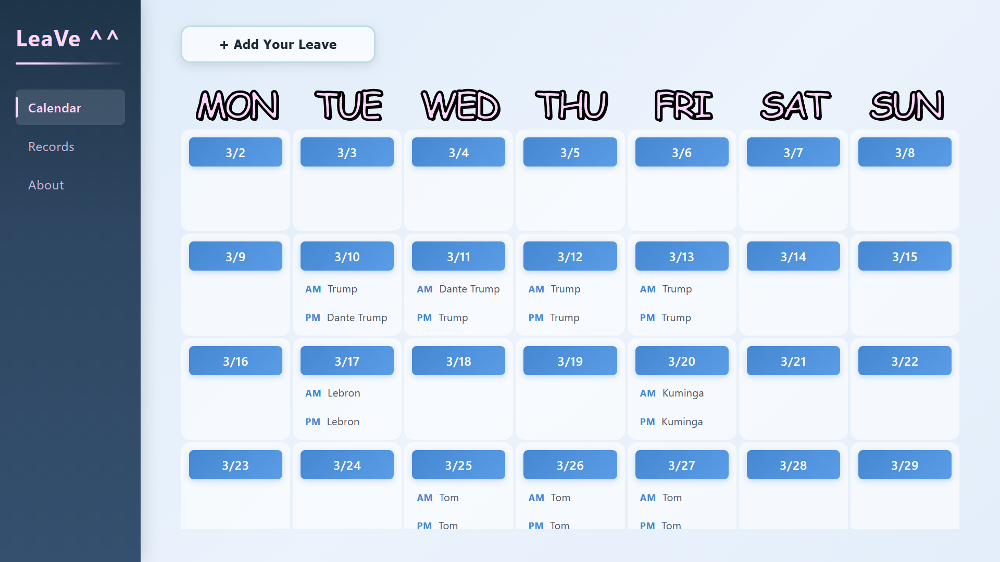
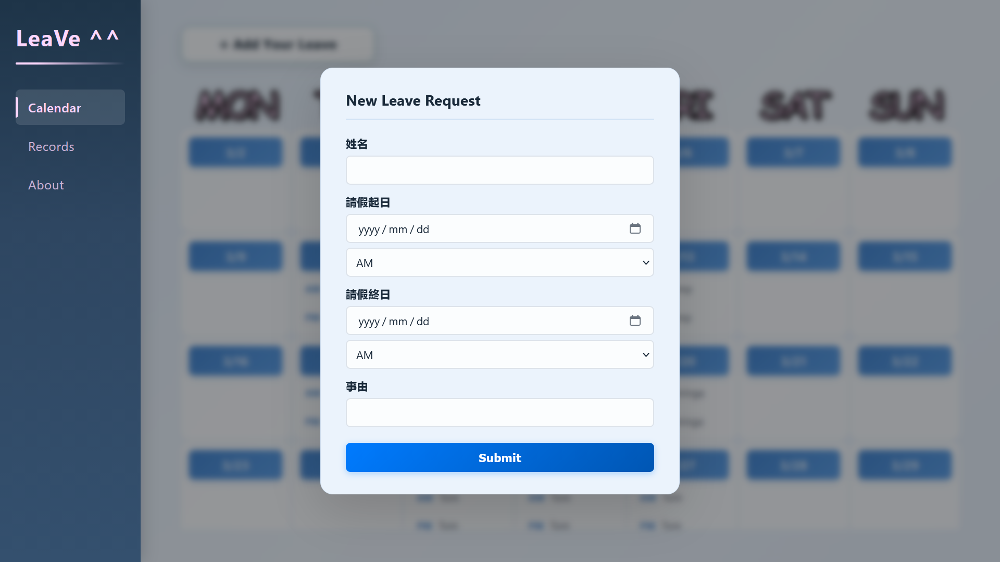
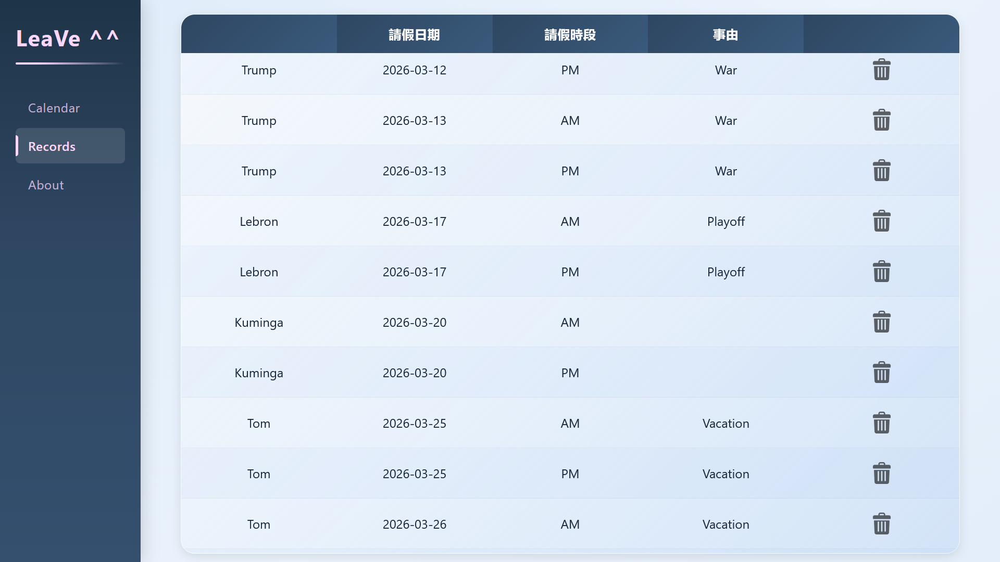
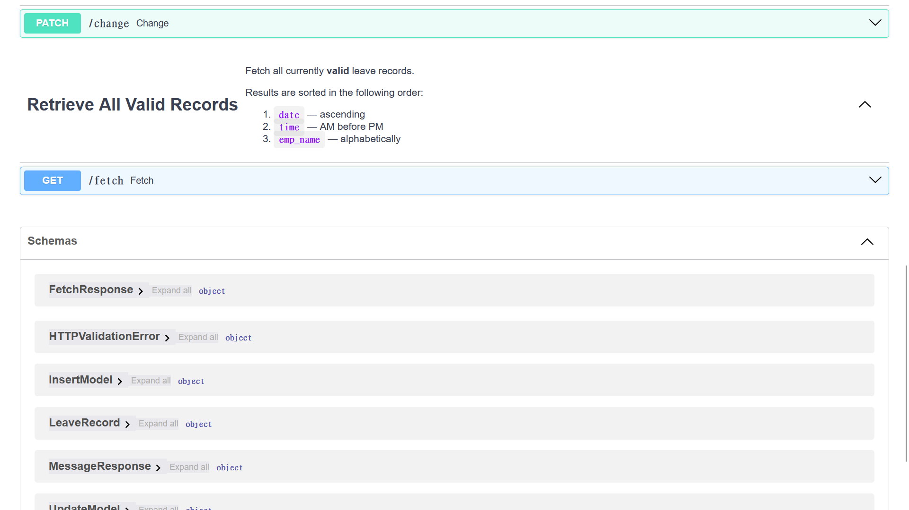

# Team Leave Manager

> A user-friendly Leave Management website for team members to manage and track their leave records efficiently.

![python-image] ![duckdb-image] ![fastapi-image] ![react-image] ![vite-image]

## Overview

Team Leave Manager is a tool designed to help teams manage their leave records effectively. It provides a user-friendly interface for team members to create, view, and manage their leave records. The application is built using FastAPI for the backend and React for the frontend, with DuckDB as the database.

### Landing page

The landing page features a calendar that displays all leave records, allowing users to easily visualize their leave schedule and plan accordingly.



### Create new leave

Users can create a new leave record by filling out the form with the necessary details, such as leave type, start date, end date, and reason for leave. Once submitted, the new leave record will be added to the calendar and records page.



### Records page

The records page provides a comprehensive view of all leave records, allowing users to filter and search for specific records based on various criteria such as date range, leave type, and status. This page also allows users to edit or delete existing leave records as needed.



### Backend API doc

FastAPI automatically generates interactive API documentation using Swagger UI. This allows developers to easily explore and test the API endpoints, making it easier to understand how to interact with the backend services.



## Prerequisites

Make sure you have the following software with the specified versions or higher version installed on your machine:

|         | versoin |
| ------- | ------- |
| python  | 3.12.10 |
| uv      | 0.9.17 |
| node.js | 24.12.0 |

## Installation

To set up the project locally, follow these steps:

- Clone the repository :

  ```bash
  git clone https://github.com/xinhuang0716/team-leave-manager.git
  ```

- Frontend

   - Install Node.js modules:

      ```bash
      cd team-leave-manager
      npm install
      ```

- Backend

   - Create virtual environment & install Python dependencies:

      ```bash
      cd team-leave-manager/backend
      uv sync
      ```

## Usage

Use the following script to launch `backend` server:

```bash
cd team-leave-manager/backend
uv run main.py
```

And run the following script to launch `frontend` server:

```bash
cd team-leave-manager
npm run dev
```

Now, you can browse the frontend at `http://localhost:5173`. The frontend will make API calls to the backend server to fetch and manage leave records.

To access the API documentation, navigate to `http://localhost:8000/docs` in your web browser. This will open the Swagger UI, where you can explore and test the available API endpoints.

## Release History

- 0.1
  - It's a beta release, still need to polish.
- 0.2
  - Refactor the code structure and polish the UI design. Also fix some bugs while data streamlining the backend logic.

## TO-DO

- Authentication (Optional)
- Log record

## Contributing

- tom.h.huang
- jason.hp.hsu

## Contact

Shall you have any problem, please let me knows. Look forward to your feedbacks and suggestions!

```
Name:  HSIN, HUANG
Email: tom.h.huang@fubon.com
Tel:   02-6608-0879 #69175
Dept:  證券 數據科學部 模型建置科(5F)
```

<!-- Markdown link & img dfn's -->

[python-image]: https://img.shields.io/badge/python-3670A0?style=for-the-badge&logo=python&logoColor=ffdd54
[react-image]: https://shields.io/badge/react-black?logo=react&style=for-the-badge
[fastapi-image]: https://img.shields.io/badge/FastAPI-005571?style=for-the-badge&logo=fastapi
[vite-image]: https://img.shields.io/badge/Vite-646CFF?style=for-the-badge&logo=Vite&logoColor=white
[duckdb-image]: https://img.shields.io/badge/Duckdb-000000?style=for-the-badge&logo=Duckdb&logoColor=yellow
