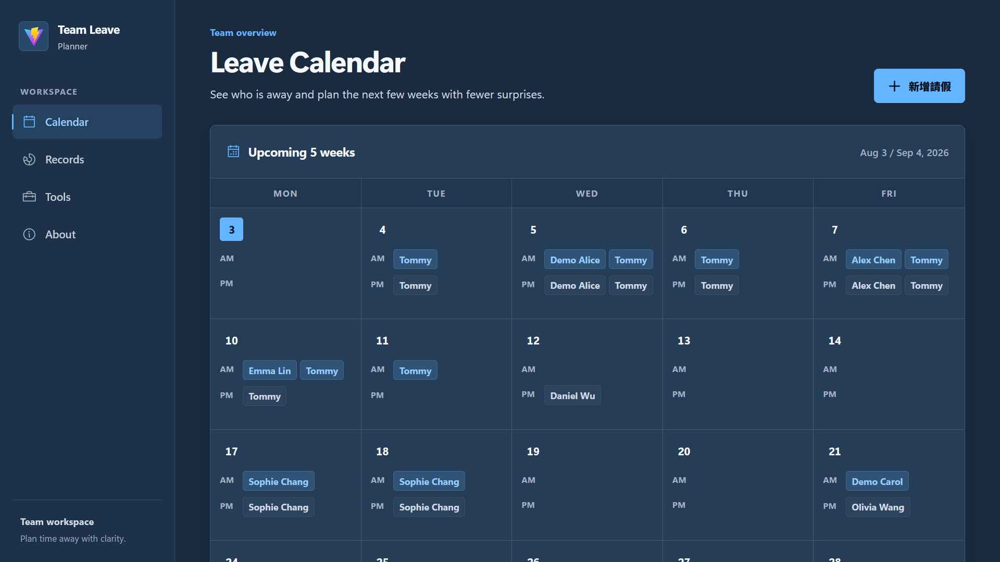
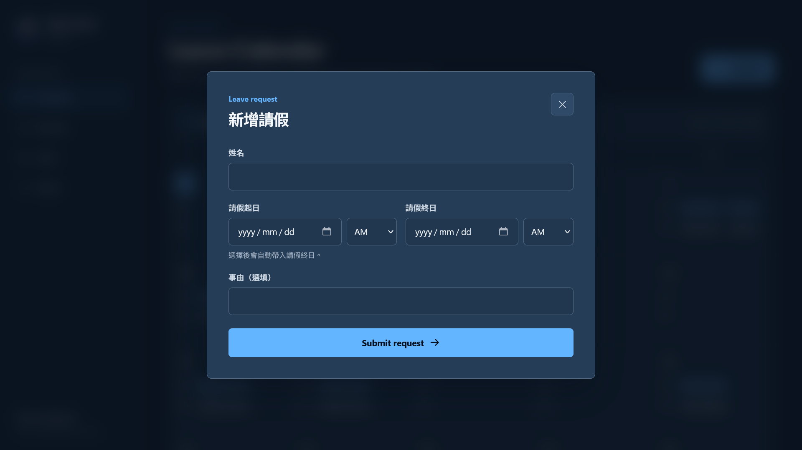
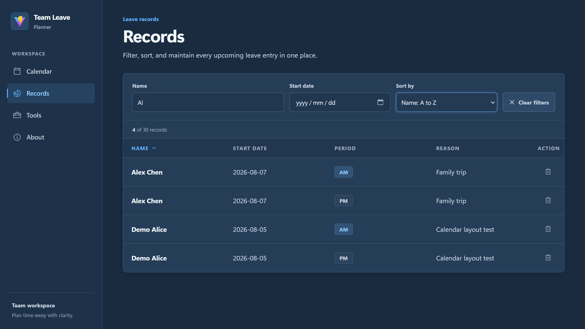
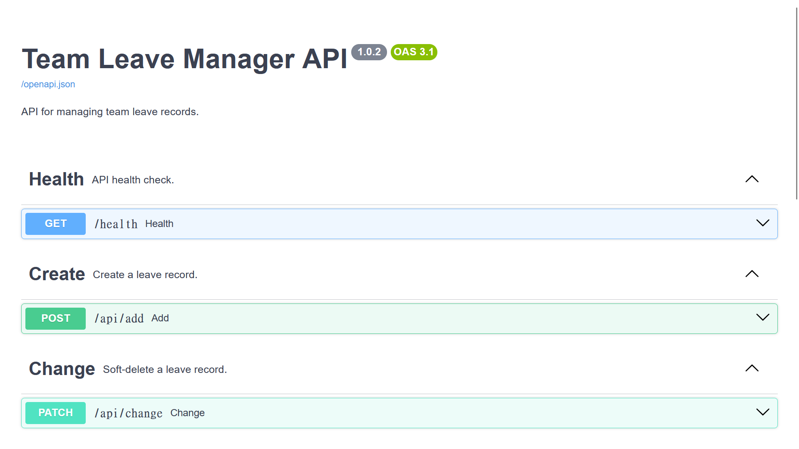

# Team Leave Manager

> A lightweight team leave planner for viewing, creating, and maintaining upcoming leave records.

![python-image] ![fastapi-image] ![cloudflare-image] ![react-image] ![vite-image]

## Overview

Team Leave Manager is a web application that helps teams coordinate upcoming leave in one shared workspace. The frontend is built with React and Vite. The FastAPI backend accesses leave records in Cloudflare D1 through the Cloudflare Python SDK.

The application includes a five-week workday calendar, a records workspace with filtering and sorting tools, and dedicated Tools and About pages. The frontend keeps its data in sync with the backend after records are created or removed.

### Landing page

The landing page displays Monday-to-Friday leave schedules for the upcoming five weeks. Each day is divided into AM and PM periods, and the current day is highlighted for quick orientation.



### Create new leave

Users can create leave records from the calendar page by entering a name, start and end dates, AM/PM periods, and an optional reason. A multi-day request is split into individual daily records and appears on both the calendar and records page after submission.



### Records page

The records page lists upcoming active leave records. Users can search by name, filter by date, sort by date or name, clear filters, and delete a record after confirmation. Deletion is handled as a soft delete in the backend so removed records are excluded from the active view.



### Backend API doc

FastAPI automatically generates interactive API documentation using Swagger UI. The documentation covers the health check, create, change, and records endpoints, allowing developers to inspect and test the backend API.



## Prerequisites

Make sure the following software is installed:

|         | version               |
| ------- | --------------------- |
| Python  | 3.12 or later         |
| uv      | latest stable version |
| Node.js | latest stable version |

Create a Cloudflare D1 database, then run the following SQL in its console to create the `LEAVE` table:

```sql
CREATE TABLE IF NOT EXISTS LEAVE (
    CREATE_TIME TEXT NOT NULL DEFAULT CURRENT_TIMESTAMP,
    DELETE_TIME TEXT NOT NULL DEFAULT 'N',
    EMP_NAME TEXT NOT NULL,
    DATE TEXT NOT NULL,
    TIME TEXT NOT NULL CHECK (TIME IN ('AM', 'PM')),
    REASON TEXT,
    PRIMARY KEY (EMP_NAME, DATE, TIME, DELETE_TIME)
);
```

The backend needs a Cloudflare API token with access to the D1 database, the Cloudflare account ID, and the D1 database ID. Copy `backend/config/.env.example` to `backend/config/.env` and fill in all three values:

```dotenv
CLOUDFLARE_API_TOKEN=your_api_token
CLOUDFLARE_ACCOUNT_ID=your_account_id
D1_ID=your_database_id
```

## Installation

To set up the project locally, follow these steps:

- Clone the repository :

  ```bash
  git clone https://github.com/xinhuang0716/team-leave-manager.git
  ```

- Frontend
  - Install Node.js modules:

    ```bash
    cd team-leave-manager
    npm install
    ```

- Backend
  - Create the virtual environment and install Python dependencies:

    ```bash
    cd team-leave-manager/backend
    uv sync
    ```

## Usage

Start the backend server with:

```bash
cd team-leave-manager/backend
uv run main.py
```

In a second terminal, start the frontend development server with:

```bash
cd team-leave-manager
npm run dev
```

You can browse the frontend at `http://localhost:5173`. It calls the backend at `http://localhost:8000` to fetch and manage leave records.

To access the API documentation, navigate to `http://localhost:8000/docs` in your web browser. This will open the Swagger UI, where you can explore and test the available API endpoints.

## Release History

- 0.1
  - Beta release; further polishing is still needed.
- 0.2
  - Refactored the code structure and polished the UI design.
  - Fixed bugs and streamlined the backend logic.
- 0.3
  - Optimized the backend implementation.
  - Enhanced frontend functionality with record filtering and sorting.
  - Automatically fills in the end date after a start date is selected.
  - Further refined the UI design and user experience.
- 0.4
  - Migrated leave-record storage from DuckDB to Cloudflare D1.
  - Updated the FastAPI backend to query D1 through the Cloudflare Python SDK.
  - Added environment-based D1 configuration and Taiwan-time handling for record queries and timestamps.

## TO-DO

- Authentication (optional)
- Audit log for record changes

## Contributing

- tom.h.huang
- jason.hp.hsu

## Contact

If you encounter any problems or have suggestions, please feel free to get in touch.

```
Name:  HSIN, HUANG
Email: tom.h.huang@fubon.com
Tel:   02-6608-0879 #69175
Dept:  證券 數據科學部 模型建置科(5F)
```

<!-- Markdown link & img dfn's -->

[python-image]: https://img.shields.io/badge/python-3670A0?style=for-the-badge&logo=python&logoColor=ffdd54
[react-image]: https://shields.io/badge/react-black?logo=react&style=for-the-badge
[fastapi-image]: https://img.shields.io/badge/FastAPI-005571?style=for-the-badge&logo=fastapi
[vite-image]: https://img.shields.io/badge/Vite-646CFF?style=for-the-badge&logo=Vite&logoColor=white
[cloudflare-image]: https://img.shields.io/badge/Cloudflare-F38020?style=for-the-badge&logo=Cloudflare&logoColor=white
