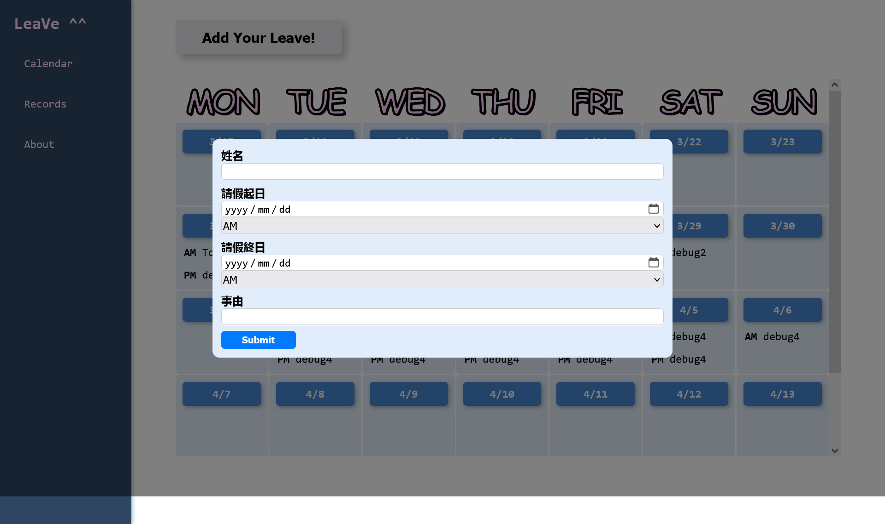
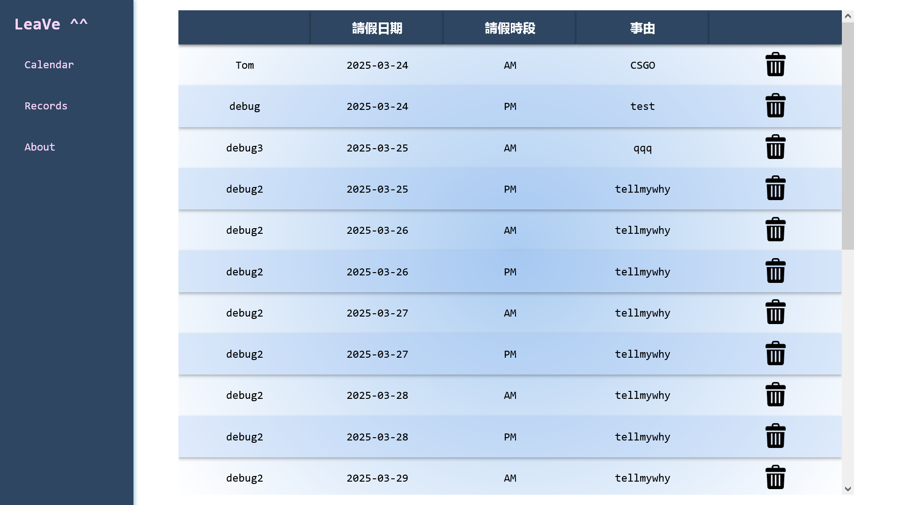
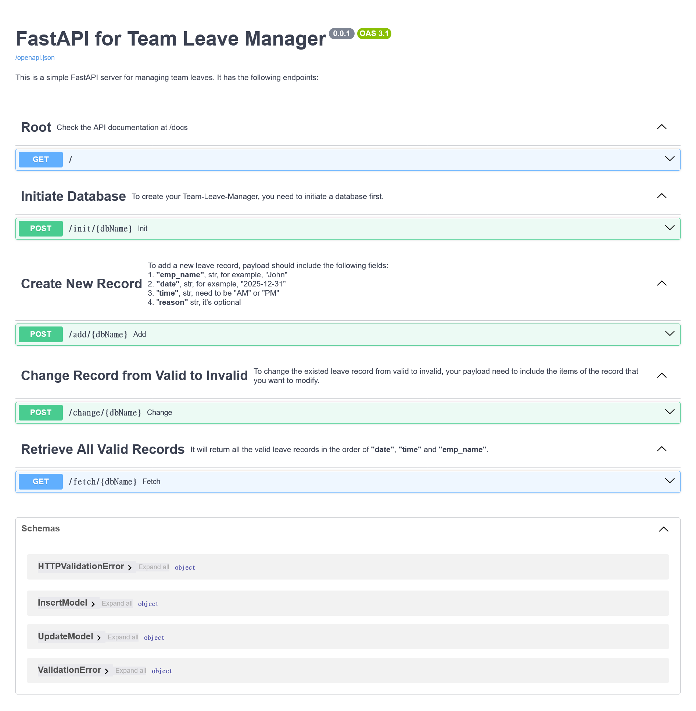

# Team Leave Manager

> A user-friendly Leave Management website for fellows

![python-image] ![fastapi-image] ![vite-image] ![react-image]

## Overview

Team Leave Manager is a tool designed to help team members manage and track their leave records efficiently. It provides a user-friendly interface for submitting, modifying, and tracking leave records.

### Landing page

The landing page features a calendar that displays all leave records, allowing you to instantly see your teammates' schedules at a glance


### Create new leave

After clicking the Add Your Leave!!! button, you can enter your leave message in the pop-up window



### Records page

The records page contains all valid leave records. To modify your leave record, simply click the delete button



### Backend API doc

All backend API functions are described in the Swagger documentation



## Dependencies

Describe any prerequisites, libraries, OS version, etc., needed before installing program.

|            | versoin |
| ---------- | ------- |
| python     | 3.11.9  |
| virtualenv | 20.29.3 |
| node.js    | 22.14.0 |

## Installation

To install Team Leave Manager, follow these steps:

- Clone the repository :

  ```bash
  git clone https://github.com/xinhuang0716/team-leave-manager.git
  ```

- Navigate to the project directory:
  ```bash
  cd team-leave-manager
  ```

### Backend

1. Create virtual environment:

   ```bash
   virtualenv venv
   ```

2. Activate the environment:

   ```bash
   cd venv/Scripts
   activate
   ```

3. Install the dependencies:
   ```bash
   pip install --trusted-host pypi.org --trusted-host pypi.python.org --trusted-host files.pythonhosted.org --default-timeout=1000 -r ./requirements.txt
   ```

### Frontend

1. Intall Node.js modules:

   ```bash
   cd team-leave-manager
   npm install
   ```

## Usage

After activate `venv` environment, run the following script to launch `backend` server:

```bash
cd team-leave-manager
uvicorn server:app --reload --host 0.0.0.0 --port 8000
```

And run the following script to launch `frontend` server:

```bash
cd team-leave-manager
npm run dev
```

Next, you can view the Team Leave Manager web app at `http://localhost:5173/`.`

To access the backend, use `http://localhost:8000`

For the Swagger API UI, visit `http://localhost:8000/docs`.`

## Release History

- 0.1
  - It's a beta release, still need to polish

## TO-DO

|To-do list|
|-|
|UI design still need to polish|
|The frontend structure and coding style should be more organized|
|Backend optimization (e.g., I/O performance, session stability, etc.)|
|RWD|
|Authentication (Optional)|

## Contributing

- tom.h.huang
- jason.hp.hsu

## Contact

Shall you have any problem, please let me knows. Look forward to your feedbacks and suggestions!

```
Name:  HSIN, HUANG
Email: tom.h.huang@fubon.com
Tel:   02-6608-0879 #69190
Dept:  證券 數據科學部 資料服務處(5F)
```

<!-- Markdown link & img dfn's -->

[python-image]: https://img.shields.io/badge/python-3670A0?style=for-the-badge&logo=python&logoColor=ffdd54
[react-image]: https://shields.io/badge/react-black?logo=react&style=for-the-badge
[fastapi-image]: https://img.shields.io/badge/FastAPI-005571?style=for-the-badge&logo=fastapi
[vite-image]: https://img.shields.io/badge/Vite-646CFF?style=for-the-badge&logo=Vite&logoColor=white
[duckdb-image]: https://img.shields.io/badge/Duckdb-_-blue
